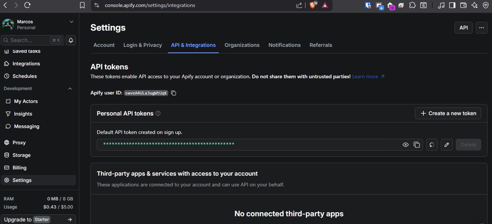

Para ejecutar el programa primero es necesario instalar las librerias que se encuentran
en requirements.txt

Puede hacerlo mediante cmd usando el comando: 
pip install -r requirements.txt

despues es necesario crear un archivo llamado .env en la raiz del proyecto
New-Item .env

y agregar dentro del mismo:
API_TOKEN=apify_api_*************************************

este apify_api se obtiene en la pagina de Apify
https://console.apify.com/settings/integrations
crear una cuenta es gratis y da 8 GB de Ram y 5$ de uso sin cargo adicional

despues de generar un token, ya se puede ejecutar el proyecto con el comando:
python main.py

Lo primero que pedirá es un usuario existente de instagram
Si la cuenta existe y es pública aparecerá estas opciones:
1 - Los 10 primeros posts (mas antiguos)
2 - Los 10 ultimos posts (mas recientes)

finalmente extraerá la data de 10 posts del usuario objetivo y la exportará
a un archivo.xlsx que se guardará en la ruta seleccionada por el objetivo

Ejemplo de extracción de datos del usuario: anyataylorjoy
realizada el dia: 23/04/2026

